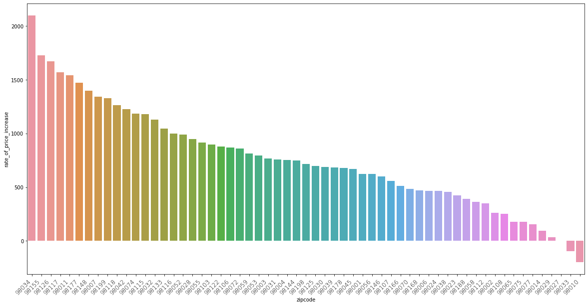
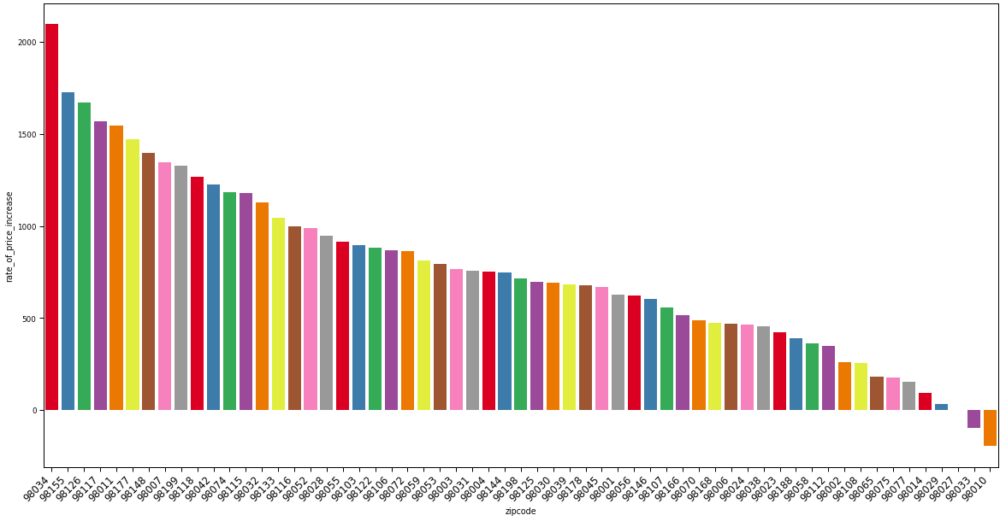
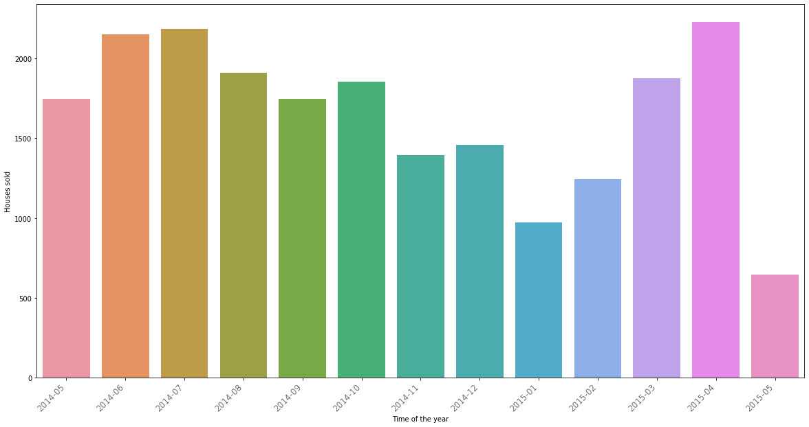
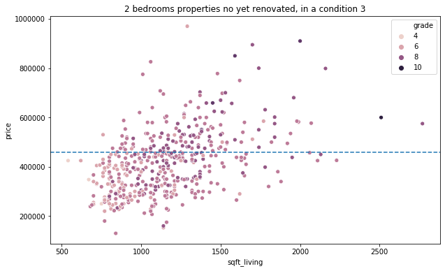
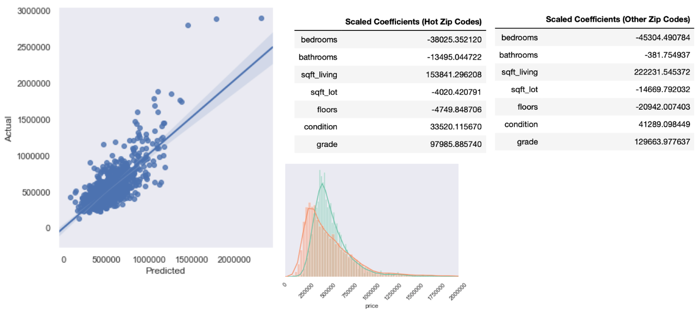

# KayCee project

## The data
The data is tabular and has 21597 rows and 21 columns. Which translates into 21597 sales during a period running between the 02/05/2014 and the 27/05/2015. Those sales are identified by an `id` column and contain `lat`/`long` data as well as some parameters which will be used to characterise the house, such as amount of `bedrooms`, size of the living area, etc.

## Preliminary analysis
These houses sold a couple of time during the interval allowed us to analyse the growth of the market. The result of this analysis is summarized in the following chart. We can see most of the zipcodes have a positive growth which indicates a healthy market for landlords and property developers.

## The focus
Based on this information we decided to focus our interest on a list of 12 neighbouring zipcodes. As shown in the map below, the Northern part of Lake Washington and the upper part of the peninsula are the areas that have seen the biggest increase. The southern demarcation of our area of interest is a belt of less performing zipcodes. These areas are less interesting mainly due to the presence of a highway.

## The timing
Another subset we have assessed is the seasonality of this dataset. Intuitively the peak season is May to August, which means the competition is more intense during this period. This might be worth taking into account when putting a property on the market. Also worth noting, the average price of the properties remains stable during the whole year.

## The opportunities
Now that we have answered the question of the location and timing, we've compared renovated houses and non renovated houses in order to see which houses are underrated and underpriced. Most houses will be part of a rather dense cloud of point but there are a few properties which are clearly underpriced and if brought to a better condition could easily yield up to 33% profit (minus renovation costs, fees and taxes)

## The regression
We were also able to create a model allowing us to underestand what and how features (variables) impact the price of a property. We've run those on the global dataset as well as the area of focus and the following observations have been made:
* The surface of living and the grade of the building are the variable that have the most impact on the price of a property
* However compared to the properties out of our zone of focus, these variables seem to be less significant.
* The average price of a property in our focus area is lower than the average price in the rest of the county.

## TL;DR
The Seattle market is generally in good shape and it is almost certain the value of a property will increase with time. The market is definitely suited for landlords and property developers. Some areas are more up-and-coming and there are lots of opportunities to generate profit or buy an undervalued property. The timing of the purchase/sale is not as important as it would be in some other areas but the competition intensifies during summer. In our area of focus, the typical buyer seem to be less specific about the condition and size of a property but this come at the expense of the property price as the average price is lower than the county average for property prices. 

Work done by Joe Ryan, Sandy Lee and Antoine Ghilissen.

### Thanks for reading!